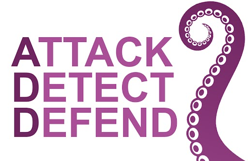

# NECSC24

## Nebraska Cyber Security Conference - Talk Slides &; Content

This-two part talk is a condensed sample from a 16hr training course Jordan and Kent teach, offered by AntiSyphonTraining.com.

In the two sessions we will give an overview into what we call threat optics: auditing endpoints, centralizing logs and visualizing results.

Each student will leave the class having experienced a penetration test through three distinct perspectives, each building on the previous. These will include adversarial attacks, examination of defensive postures, and wrapped up with various detection methodologies using open-source or free industry threat detection and defenses.



![DIV1]


# Course Pre-requisites
This talk disc
- GitHub Account 
- Azure Account 
- DOAZLab.com Azure Deployment
- Detailed Instructions: [ADD-Pre-Reqs](https://github.com/DefensiveOrigins/ADD-PreReqs/blob/main/README.md) 

# Course Information 
&#x1F6C8;  [H0001 - Course Information][H0001]  
&#x1F6C8;  [H0004 - Course Instructors][H0004]  


# Conferecne Talk Content    

## Attack Detect Defend - Part 1 (~09/17/24 9:00 AM)

### Slides
- Link to slides

### Demo Commands

``` bash
commands
```


## Attack Detect Defend - Part 2 (~09/17/24 10:00 AM)

### Slides
- Link to slides

### Demo Commands

``` bash
commands
```


Copyright - All Rights Reserved, Defensive Origins LLC
<!-- DO-MD-FOOTER-END -->

<!-- DO-MD-SHORTCUTS-START -->
[Home]: ./README.md
[evidref]: 9-Others/Cheatsheets/EventIDs.md
[addlogo]:Z-images/logo/add.png
[addlogosm]:Z-images/logo/addsm.png
[addlogo]:../../Z-images/logo/add.png
[addlogosm]:../../Z-images/logo/addsm.png
[WWHF]: https://wildwesthackinfest.com/
[XXXX]: https://www.google.com
[ph_jd]: Z-images/photo/jd1.png
[ph_ki]: Z-images/photo/ki1.png
[H0004]: /9-Others/H0040-Instructors/README.md
[H0001]: /9-Others/H0001/README.md
[DOImage]: Z-images/do_darkbackground.jpg
[DOImage]:Z-images/do_darkbackground.jpg
[DefOrg]: https://defensiveorigins.com/
[Div1]: Z-images/div/div1.png
[Div2]: Z-images/div/div2.png
[DO]: https://www.defensiveorigins.com
[DO1]: Z-images/logo/DO1.png
[DO1sm]: Z-images/logo/DO1sm.png
[DOAboutUs]: https://defensiveorigins.com/about-us
[DOAZLab]: https://www.doazlab.com
[DOAZLab-Github]: https://github.com/DefensiveOrigins/DO-LAB
[1]: https://defensiveorigins.com/
[2]: https://wildwesthackinfest.com/training/
[APT]:https://github.com/DefensiveOrigins/AtomicPurpleTeam